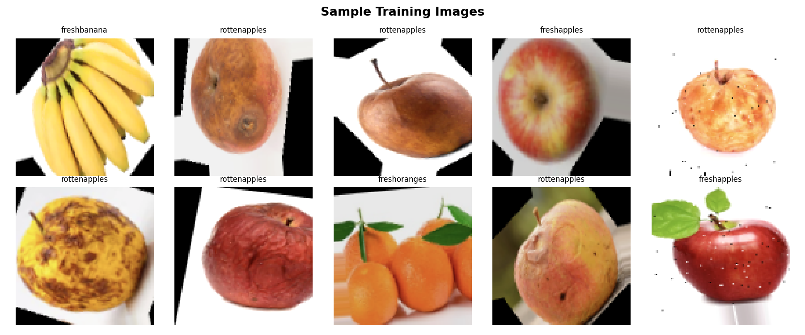
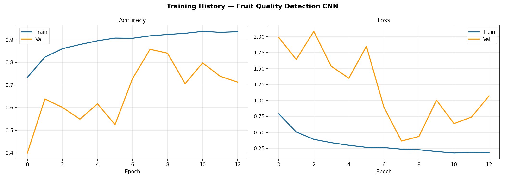
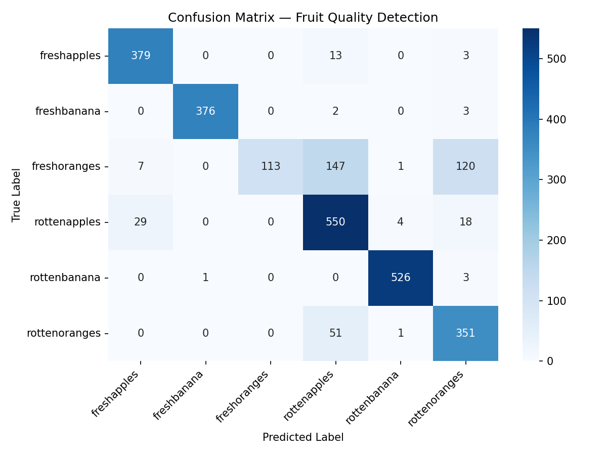

# 🍎 FreshScan AI — Fruit Quality Detection Using CNN

An AI-powered web application that detects whether a fruit is **fresh or rotten** using a Convolutional Neural Network (CNN), built with TensorFlow and deployed with Streamlit.

🔗 **Live Demo:** [fruitquality-satya.streamlit.app](https://fruitquality-satya.streamlit.app)

---

## 📌 Overview

This project classifies fruit images into 6 categories — fresh and rotten variants of apples, bananas, and oranges — using a custom-built CNN trained from scratch. The model achieves **85.06% test accuracy** and is deployed as an interactive web app where anyone can upload a fruit image and instantly see the freshness prediction along with a confidence score.

## ✨ Features

- 📤 Upload any fruit image (JPG/PNG)
- 🔍 Real-time prediction: Fresh or Rotten
- 📊 Confidence score and full probability breakdown across all 6 classes
- 🎨 Clean, modern UI built with Streamlit
- 🌐 Fully deployed and publicly accessible

## 🧠 Model Architecture

A 3-block CNN built from scratch in TensorFlow/Keras:

- **Block 1–3:** Conv2D → BatchNormalization → Conv2D → MaxPooling → Dropout (progressively increasing filters: 32 → 64 → 128)
- **Classifier Head:** Flatten → Dense(256) → BatchNormalization → Dropout → Dense(6, softmax)
- **Regularization:** Data augmentation (rotation, zoom, flip, brightness) + Dropout + BatchNorm to prevent overfitting
- **Training:** Adam optimizer, categorical cross-entropy loss, EarlyStopping + ModelCheckpoint callbacks

## 📊 Results

| Metric | Score |
|---|---|
| Test Accuracy | 85.06% |
| Best Validation Accuracy | 85.77% |

**Per-class performance:**

| Class | Precision | Recall | F1-score |
|---|---|---|---|
| Fresh Apple | 0.91 | 0.96 | 0.94 |
| Fresh Banana | 1.00 | 0.99 | 0.99 |
| Fresh Orange | 1.00 | 0.29 | 0.45 |
| Rotten Apple | 0.72 | 0.92 | 0.81 |
| Rotten Banana | 0.99 | 0.99 | 0.99 |
| Rotten Orange | 0.70 | 0.87 | 0.78 |

**Note:** Fresh oranges showed lower recall due to visual similarity with certain apple varieties under the same lighting conditions — a known limitation worth addressing with a larger, more diverse dataset or transfer learning in future iterations.

## 🛠️ Tech Stack

- **Language:** Python
- **Deep Learning:** TensorFlow, Keras
- **Image Processing:** OpenCV, NumPy
- **Web App:** Streamlit
- **Visualization:** Matplotlib, Seaborn
- **Deployment:** Streamlit Community Cloud
- **Dataset:** Fruits Fresh and Rotten for Classification (Kaggle)

## 🚀 Run Locally

git clone https://github.com/satyapinapothula/fruit-quality-detection.git
cd fruit-quality-detection
pip install -r requirements.txt
streamlit run app.py

## 👤 Author

**Pinapothula Satya Sai Durga**
B.Tech Computer Science Engineering, RGUKT Ongole
